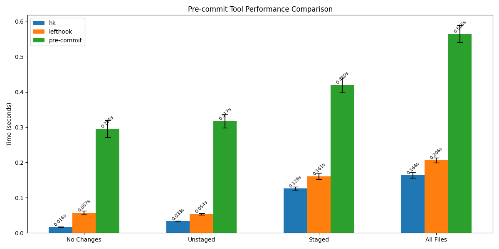

# About

hk is built by [@jdx](https://github.com/jdx).

## Why does this exist?

I wanted a git hook manager that was fast and I didn't see any
existing tools that integrated well enough with linters to actually perform as
fast as they could.

I recognized that in order for git hooks to perform fast, they need to run in parallel. That said, since linters also often (but not always) modify files, it's
not possible to naively run them in parallel or they could stomp on each other if modifying the same files at the same time. E.g.: you may run eslint and prettier
on the same `.js` file.

That doesn't mean we have to run everything in series though. A lint manager which
was aware of how linters will behave could grab read/write locks and only grab
write locks for a short period of time would ultimately enable a lint manager to
lint a codebase or set of changes very quickly.

It takes a bit more time to implement linters in hk than it does with similar tools
in order to take advantage of this benefit which is one reason why it comes with
many [builtins](https://github.com/jdx/hk/tree/main/pkl/builtins) to get you started with common tools. See [hooks](/hooks) for more details on how this works under the hood.

To compare with 2 other popular tools in this space: I like that [lefthook](https://github.com/evilmartians/lefthook) is pretty lightweight and fast. I don't like how you need to write all the logic to integrate with
linters yourself and that it lacks any real locking behavior allowing for the advanced parallelism hk provides. I like how [pre-commit](https://pre-commit.com) has
a plugin interface for sharing lint configuration but I found the DX pretty lackluster around plugins and it doesn't seem to really support parallelism—it is very
briefly mentioned in the docs but it explains nothing about it. In hk, parallel execution is basically the entire idea everything else is built around.

Being a Rust CLI, hk is also much faster starting up than other CLIs. This mostly optimizes the no-op use-case—such as running `git commit --amend` with no repo changes or minimal changes which matters in terms of making hk feel very snappy. You likely won't be able to notice hk being used at all if there aren't git changes.

Beyond that, I used my experience building [mise-en-place](https://mise.jdx.dev) incorporating various tricks I've found building that which has resulted in better
CLI performance such as coding directly to libgit2 rather than shelling out to `git`. Another technique is that hk can split execution of single-threaded linters (such as eslint and prettier) across multiple processes each linting a different set of files.

## Benchmarks

These are basic benchmarks on the hk codebase which is admittedly a simple codebase. Real-world benchmarks with large codebases will likely show hk to be
much faster when it is able to take advantage of its deep parallelism capabilities.

## Roadmap

There isn't one yet. This project will hit 1.0 when I feel it has good enough parity that almost anyone would be able to switch from lefthook or pre-commit to hk.

Until then, expect frequent breaking changes and experimentation as I try to identify the proper behavior of hk.

## Contributing

Contributions are welcome! Please open an issue or submit a PR.
